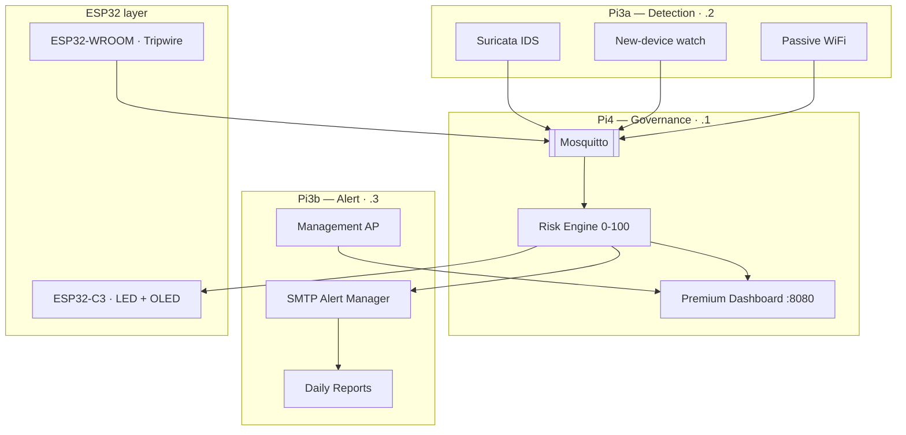

<p align="center">
  
</p>

<p align="center">
  <a href="https://github.com/ADITYA02NM/ULTRON"></a>
  
  
  
  
  
</p>

---

## The Problem

Smart homes run dozens of IoT endpoints — cameras, locks, sensors, hubs, assistants — almost none of them monitored. Meanwhile:

| Reality | Cost |
|---------|------|
| Managed SOC / SIEM | **$500K–$2M / year** |
| Entry commercial appliance | **$2,000+** + licenses |
| Households that suffer a breach and lose trust / devices | **Immediate privacy & physical risk** |
| Smart-home IoT endpoints on typical home networks | **Almost unmonitored** |

Alerts alone do not save a home. Owners need an **autonomous loop**: detect at the IoT layer, **govern** risk with a score, and **manage alerts** so a human only acts when it matters.

---

## What Is ULTRON?

**ULTRON** is a self-contained, zero-cloud **IoT cybersecurity ecosystem for smart houses** on ~**$290** of hardware:

| Pillar | What ships in Phase 1 (Black Hat) |
|--------|-----------------------------------|
| **Detection** | Suricata IDS, passive LAN watch (new device), ESP32 tripwires, passive WiFi monitor |
| **Governance** | Risk engine 0–100 → GREEN / YELLOW / RED / PURPLE, weighted fusion, decay, escalation policy |
| **Alert management** | **Premium dashboard** (no compromise), WebSocket &lt;100ms, SMTP on RED/PURPLE, LED/OLED, ack + Markdown reports |

**Future scope (documented, not built yet):** automated **response** (Phase 2) and **automated threat analysis / hunting** (Phase 3).

> **One sentence:** Three Raspberry Pis + two ESP32s that **detect → govern → alert** on the smart-home IoT layer — fully offline, fully autonomous.

---

## Black Hat Asia 2027 — IoT Track

| | |
|--|--|
| **Focus (Phase 1)** | Detection · Governance · Alert management |
| **Dashboard** | Top notch. No compromise. |
| **Future** | Response · Automated threat analysis / hunting |
| **Mode** | **ULTRON only** — continuous autonomous operation |
| **Cloud** | None. Ever. |

---

## How It Works — Detection → Governance → Alert

```
  ┌─────────────────────────────────────────────────────────────────┐
  │  DETECTION (Pi3a)          GOVERNANCE (Pi4)       ALERT (Pi3b) │
  │  ─────────────────         ───────────────       ─────────────  │
  │  Suricata IDS      ──┐                       ┌─ Dashboard       │
  │  New-device watch  ──┤                       │  (Pi4 :8080)     │
  │  ESP32 tripwires   ──┼──► MQTT ──► Risk ─────┼─ Email SMTP      │
  │  Passive WiFi      ──┤      bus    0–100     │  LED / OLED      │
  │                     ──┘    + bands           └─ Daily .md       │
  │                           decay · weights      ack · history    │
  └─────────────────────────────────────────────────────────────────┘
```

### Risk bands

| Band | Score | Physical | Phase 1 action |
|------|-------|----------|----------------|
| 🟢 GREEN | 0–29 | Solid | Monitor |
| 🟡 YELLOW | 30–59 | Chase | Dashboard attention |
| 🔴 RED | 60–84 | Strobe | **Critical email** + alarm UI |
| 🟣 PURPLE | 85–100 | Pulse | Escalate to operator (response = Phase 2) |

---

## Architecture



| Node | Pillar | IP | Job |
|------|--------|-----|-----|
| **Pi4 8GB** | **Governance** | .1 | MQTT, risk engine, **premium dashboard**, health, **pendrive evidence**, **AC600 mgmt AP**, SSD offload scripts |
| **Pi3B+** | **Detection** | .2 | Suricata, new-device watch, **TL-WN722N** passive WiFi, tripwire sense |
| **Pi3B+** | **Alert** | .3 | Alert manager (SMTP), reports → **Pi4 pendrive vault**, tripwire sense |
| **ESP32-C3** | Indicator | USB→Pi4 | NeoPixel band + OLED score |
| **ESP32-WROOM** | Tripwire | GPIO | Case open (no WiFi, no buzzer) |

---

## Hardware Connections

Real wiring for the smart-house shelf. Matches [`architecture.md`](architecture.md) §3 + §8.

### Connection map

```
                         ┌──────────────────────────────────────┐
   HOME ROUTER / ISP     │     5-PORT GIGABIT SWITCH           │
         │               │     (all three Pis on eth0)         │
         │ uplink        │                                     │
         └───────────────┤  eth0                               │
                         │   ├─ Pi4  Governance  .1 ──────────┤
                         │   ├─ Pi3a Detection   .2 ──────────┤
                         │   └─ Pi3b Alert       .3 ──────────┤
                         └──────────────────────────────────────┘

  Pi4 Governance (.1)
    ├── USB 3.0 ────────── AC600 → hostapd AP "SENTINEL-SECURE"
    ├── USB 3.0 ────────── pendrive (evidence vault: SQLite + reports)
    ├── USB 2.0 ────────── ESP32-C3 SuperMini (serial 115200)
    │                        └── GPIO → SSD1306 OLED
    │                        └── GPIO → WS2812B ×8 (if fitted)
    ├── optional dock ──── SSD (admin-key OS + SD offload via scripts)
    └── eth0 ───────────── switch

  Pi3a Detection (.2)
    ├── USB ────────────── TL-WN722N (passive monitor only)
    ├── GPIO ◄──────────── ESP32-WROOM GPIO16  (case reed)
    └── eth0 ───────────── switch

  Pi3b Alert (.3)
    ├── (no USB storage — reports land on Pi4 pendrive vault)
    ├── GPIO ◄──────────── ESP32-WROOM GPIO17  (case reed)
    └── eth0 ───────────── switch

  SSD (portable — not always on Pi)
    ├── bootable ULTRON admin OS → any laptop → dashboard as admin
    └── scripts offload Pi SD files onto SSD to keep SD cards clean

  ESP32-C3 SuperMini  →  Pi4 USB 2.0
    ├── GPIO → SSD1306 OLED (I2C)
    └── JSON @10Hz over serial to Pi4

  ESP32-WROOM-32 (tripwire — WiFi radio OFF)
    ├── USB 2.0 (optional power only) or 3V3 from Pi3 header
    ├── GPIO16 ──► Pi3a case switch (pull-up, LOW = open)
    └── GPIO17 ──► Pi3b case switch (pull-up, LOW = open)

  MGMT ACCESS
    operator laptop ─WiFi─► SENTINEL-SECURE (Pi4 AC600)
                         ─► only http://192.168.100.1:8080

  POWER
    [PSU strip] → Pi4 (5V/3A), Pi3a (5V/2.5A), Pi3b (5V/2.5A)
    total ≈ 38 W · all on-prem · zero cloud
```

### Wiring table

| From | To | Medium | Notes |
|------|----|--------|-------|
| Home router | Switch uplink | Cat6 | Optional; production can stay air-gapped |
| Switch ports 1–3 | Pi4 / Pi3a / Pi3b eth0 | Cat6 | Static `.1` `.2` `.3` on `192.168.100.0/24` |
| **Pi4 USB 3.0** | **AC600** | USB3 | hostapd AP `SENTINEL-SECURE` → mgmt `192.168.50.0/24` |
| **Pi4 USB 3.0** | **pendrive** | USB3 | **Evidence vault** — SQLite WAL + Markdown reports |
| **Pi4 USB 2.0** | **ESP32-C3 mini** | USB2 | Serial **115200**, JSON @10Hz + `\n` |
| ESP32-C3 mini GPIO | SSD1306 OLED | I2C | Address `0x3C`, ≤4 Hz redraw |
| ESP32-C3 mini GPIO | WS2812B DIN | dupont | Optional 8-px strip, common GND |
| **Pi3a USB** | **TL-WN722N** | USB | Monitor mode — **passive only** |
| SSD (dock / laptop) | boot admin OS + offload | USB | Admin key for dashboard; scripts move files off Pi SD cards |
| WROOM GPIO16 | Pi3a GPIO | jumper | Case reed, active-low, 50ms debounce |
| WROOM GPIO17 | Pi3b GPIO | jumper | Case reed, active-low, 50ms debounce |
| WROOM 3V3/GND or USB2 | power | — | Radio **off**; tripwire cannot be remote-disarmed |
| Operator laptop | Pi4 AC600 WiFi | WiFi WPA2 | Reaches **only** `http://192.168.100.1:8080` |
| PSU strip | 3× Pi | DC | Shared strip, ~38W total |

### Pin map — ESP32-WROOM tripwire (→ Pi3s)

| WROOM pin | Direction | Destination | Logic |
|-----------|-----------|-------------|-------|
| GPIO16 | in | Pi3a case reed | pull-up; LOW = open |
| GPIO17 | in | Pi3b case reed | pull-up; LOW = open |
| USB 2.0 or 3V3 | power | Pi / hub | radio disabled |
| GND | power | common | — |

### Pin map — ESP32-C3 mini (→ Pi4 USB 2.0)

| C3 pin | Destination | Protocol |
|--------|-------------|----------|
| USB | Pi4 USB **2.0** | serial 115200, newline JSON @10Hz |
| GPIO (I2C) | SSD1306 OLED | I2C `0x3C` |
| GPIO (optional) | WS2812B DIN | single-wire NRZ |
| 5V / GND | Pi4 USB2 | power for mini + OLED |

---

## Premium Dashboard

> **No compromise.** Single `index.html` — HTML + CSS + vanilla JS. Zero CDNs. Works air-gapped on Pi4:**8080**. Event → pixel **&lt;100ms**.

- Animated risk gauge + 24h band-colored history  
- Live alert feed with **acknowledge** (SQLite-persisted)  
- Node health grid (4 tiles) + detection layer rows  
- Band-themed accent (`html[data-band]`)  
- Full spec: [`dashboard.md`](dashboard.md)

---

## Hardware — ~$290 Total

| Qty | Item | ~$ | Role |
|-----|------|----|------|
| 1 | Raspberry Pi 4 (8GB) | 75 | **Governance** |
| 2 | Raspberry Pi 3B+ | 60 | **Detection** + **Alert** |
| 1 | ESP32-C3 SuperMini | 5 | LED + OLED |
| 1 | ESP32-WROOM-32 | 6 | Tripwire |
| — | NICs, adapters, PSU, case | ~144 | Support |
| | **Total** | **~$290** | Zero cloud |

Power ≈ **38W**. All services on-prem.

---

## Design Philosophy

- **Zero cloud** — no CDN, no SaaS, no phone-home  
- **One node, one pillar** — governance / detection / alert never blur  
- **Notify-first** — Phase 1 escalates to humans; machines do not auto-block yet  
- **Evidence always** — SQLite + Markdown on **Pi4 USB3 pendrive** vault  
- **Admin key SSD** — bootable OS on any laptop opens dashboard as admin; scripts keep Pi SD cards clean by offloading files to SSD  
- **Fail-visible** — dashboard shows DEGRADED; never silent failure  
- **Built for the house** — quiet shelf form-factor, visible LED/OLED posture, no enterprise rack required  
- **Lean by design** — no honeypots, no active scanners; only sensors that earn RAM/CPU on a home guard box  

---

## Operating Mode

**ULTRON only.** Continuous autonomous detect → score → alert. No alternate modes.

---

## Quick Start

```bash
# 1. Clone
git clone https://github.com/ADITYA02NM/ULTRON.git && cd ULTRON

# 2. Static IPs
#    Pi4=.1 (Governance)  Pi3a=.2 (Detection)  Pi3b=.3 (Alert)
#    Wire per README "Hardware Connections" (switch + USB + GPIO)

# 3. Broker on Pi4
sudo apt install -y mosquitto mosquitto-clients
sudo systemctl enable --now mosquitto

# 4. Per-node services (see blackhat.md Systemd map)
#    Detection (Pi3a): suricata, sentinel-lan, sentinel-agg + TL-WN722N
#    Alert (Pi3b):     sentinel-alert, sentinel-report (→ Pi4 pendrive vault)
#    Governance (Pi4): risk, dashboard, health, hostapd/dnsmasq (AC600), SSD offload scripts

# 5. Open the showpiece (from mgmt WiFi SENTINEL-SECURE)
#    http://192.168.100.1:8080
```

---

## Roadmap

| Phase | Capability | Status |
|-------|-----------|--------|
| **Phase 1 — Black Hat** | Detection + Governance + Alert management + premium dashboard | 🎯 Current |
| **Phase 2** | Automated **response** (firewall, restarts, quarantine) | 📋 Future |
| **Phase 3** | **Automated threat analysis & hunting** | 📋 Future |
| **Black Hat** | Asia 2027 Arsenal — IoT track | 🎯 Target |

---

## Repository Structure

```
ULTRON/
├── README.md              ← you are here (pitch)
├── blackhat.md            ← full research paper / design doc
├── architecture.md        ← in-depth system architecture
├── dashboard.md           ← dashboard spec (no compromise)
├── promt.md               ← premium AI operating prompt
├── assets/
│   └── ultron-banner.svg
├── hardware.png
└── .gitignore             ← ignores ULTRON(SEN3)/ backup + noise
```

---

## Contributing

Phase 1 scope only: **detection, governance, alert management, dashboard**.  
Response and hunting stay in the roadmap until Phase 2/3.

## License

MIT

---

**An autonomous smart-house IoT ecosystem that detects, governs, and alerts — for $290.**
