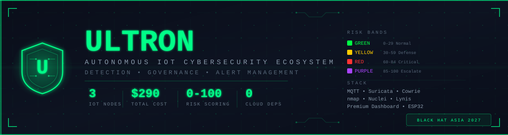
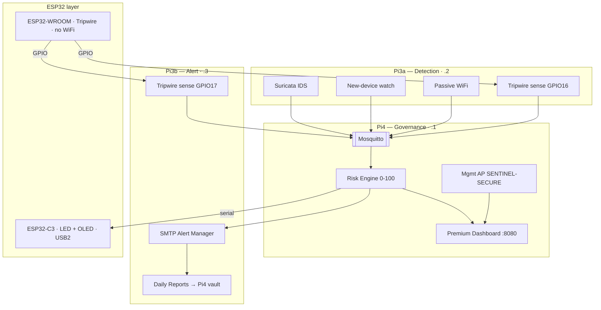

<p align="center">
  
</p>

<p align="center">
  <a href="https://github.com/ADITYA02NM/ULTRON"></a>
  
  
  
  
  
</p>

---

## The pitch in one paragraph

Smart homes are full of cameras, locks, sensors, and hubs — and almost none of them are watched. A real SOC costs half a million to two million dollars a year; a cheap appliance still wants licenses and a cloud account. **ULTRON** is the opposite: three Raspberry Pis and two ESP32s on a shelf (~**$290**, ~**38W**, **zero cloud**) that continuously **detect → govern → alert** on the IoT layer of a smart house. Phase 1 (Black Hat Asia 2027, IoT Arsenal) ships a lean detection stack, a weighted risk engine (0–100 → GREEN/YELLOW/RED/PURPLE), alert management with ack + evidence, and a **no-compromise premium dashboard** at `http://192.168.100.1:8080` that paints every event in **under 100ms** — fully offline, fully autonomous.

---

## 1. The problem

| Reality | Why it hurts |
|---------|----------------|
| Managed SOC / SIEM | **$500K–$2M / year** |
| Entry commercial appliance | **$2,000+** + licenses + often cloud |
| Household breach | Immediate privacy & physical risk (locks, cameras) |
| Typical smart-home IoT endpoints | Almost **unmonitored** |

Alerts alone do not save a home. Owners need an **autonomous loop**: detect at the IoT layer, **govern** risk with a score, and **manage alerts** so a human only acts when it matters.

---

## 2. What ULTRON is

**ULTRON** = self-contained, zero-cloud **IoT cybersecurity ecosystem for smart houses**.

| # | Pillar | Node | Phase 1 ships |
|---|--------|------|----------------|
| 1 | **Detection** | Pi3B+ `.2` | Suricata IDS, passive LAN new-device watch, ESP32 tripwires, passive WiFi monitor |
| 2 | **Governance** | Pi4 8GB `.1` | Risk engine 0–100 → bands, weighted fusion, decay, escalation **policy** (notify-only) |
| 3 | **Alert management** | Pi3B+ `.3` + Pi4 dashboard | Premium dashboard (no compromise), SMTP on RED/PURPLE, LED/OLED, ack + Markdown reports |

**One sentence:** *Three Raspberry Pis + two ESP32s that **detect → govern → alert** on the smart-home IoT layer — fully offline, fully autonomous.*

**Mode:** **ULTRON only** — continuous operation, no alternate modes.  
**Cloud:** none — ever.  
**Future (documented, not built):** automated **response** (Phase 2), automated **threat analysis / hunting** (Phase 3).

---

## 3. How it works (the loop)

```
  ┌──────────────────────────────────────────────────────────────────────┐
  │ DETECTION (Pi3a)        GOVERNANCE (Pi4)           ALERT (Pi3b)     │
  │ ─────────────           ───────────────            ─────────────     │
  │ Suricata · LAN · WiFi ─┐                            ┌─ SMTP email    │
  │ Tripwires (GPIO)      ─┼─► MQTT ─► Risk 0–100 ─┬─►  │  Daily .md     │
  │                        ┘    + bands · decay    ├─►  │  → Pi4 vault   │
  │                                                ├─► Dashboard :8080   │
  │                                                └─► LED/OLED (C3)     │
  │                                                 ack · history        │
  └──────────────────────────────────────────────────────────────────────┘
```

1. **Sense** — Suricata, LAN watch, passive WiFi, case tripwires publish JSON on `ultron/#`.  
2. **Score** — Pi4 risk engine fuses weighted inputs → one number 0–100.  
3. **Band** — GREEN / YELLOW / RED / PURPLE with hysteresis (no flicker) and decay (−2 pts / 10s when quiet).  
4. **Surface** — Dashboard paints ≤100ms; C3 LED/OLED mirrors the band; RED/PURPLE email the operator.  
5. **Evidence** — SQLite + Markdown land on the **Pi4 USB3 pendrive** vault; ack state survives refresh.

### Risk bands (Phase 1 = notify only)

| Band | Score | LED pattern | Action |
|------|-------|-------------|--------|
| 🟢 GREEN | 0–29 | Solid | Monitor |
| 🟡 YELLOW | 30–59 | Chase | Dashboard attention |
| 🔴 RED | 60–84 | Strobe | **Critical email** + alarm UI |
| 🟣 PURPLE | 85–100 | Pulse | Escalate to operator (response = Phase 2) |

**Weights:** Suricata **0.40** · Tripwire **0.30** · WiFi **0.20** · LAN new-device **0.10** · clamp 0–100 · hysteresis **+2** · only Pi4 writes `ultron/risk/#`.

---

## 4. Architecture (who runs what)



| Node | Pillar | IP | Job |
|------|--------|-----|-----|
| **Pi4 8GB** | **Governance** | .1 | MQTT, risk engine, **premium dashboard**, health, **pendrive evidence**, **AC600 mgmt AP**, SSD offload scripts |
| **Pi3B+** | **Detection** | .2 | Suricata, new-device watch, **TL-WN722N** passive WiFi, tripwire sense |
| **Pi3B+** | **Alert** | .3 | Alert manager (SMTP), reports → **Pi4 pendrive vault**, tripwire sense |
| **ESP32-C3** | Indicator | USB→Pi4 | NeoPixel band + OLED score |
| **ESP32-WROOM** | Tripwire | GPIO | Case open (radio **off**, **no buzzer**) |

**Two networks:**

| Plane | Subnet | Medium | Purpose |
|-------|--------|--------|---------|
| Production | `192.168.100.0/24` | Ethernet switch | Sensors/hosts under watch, MQTT, dashboard |
| Management | `192.168.50.0/24` | WiFi `SENTINEL-SECURE` (AC600 on **Pi4 USB3**) | Operator laptop → **only** `http://192.168.100.1:8080` |

Firewall is **nftables deny-first** on every node.

---

## 5. Hardware connections (shelf wiring)

Matches [`architecture.md`](architecture.md) §3.6. Full tables there.

```
                         ┌──────────────────────────────────────┐
   HOME ROUTER / ISP     │     5-PORT GIGABIT SWITCH           │
         │               │     (all three Pis on eth0)         │
         │ uplink        │                                     │
         └───────────────┤  eth0                               │
                         │   ├─ Pi4  Governance  .1            │
                         │   ├─ Pi3a Detection   .2            │
                         │   └─ Pi3b Alert       .3            │
                         └──────────────────────────────────────┘

  Pi4 (.1)
    ├── USB 3.0 ── AC600 → hostapd AP "SENTINEL-SECURE"
    ├── USB 3.0 ── pendrive (evidence: SQLite WAL + reports)
    ├── USB 2.0 ── ESP32-C3 → SSD1306 OLED (+ optional WS2812B)
    ├── dock ──── SSD (admin-key OS + SD-offload scripts only)
    └── eth0 ──── switch

  Pi3a (.2)
    ├── USB ───── TL-WN722N (passive monitor only)
    ├── GPIO ◄─── WROOM GPIO16 (case reed, active-low, 50ms debounce)
    └── eth0 ──── switch

  Pi3b (.3)
    ├── (no USB storage — reports → Pi4 pendrive vault)
    ├── GPIO ◄─── WROOM GPIO17 (case reed, active-low, 50ms debounce)
    └── eth0 ──── switch

  MGMT:  laptop ─WiFi─► SENTINEL-SECURE ─► only http://192.168.100.1:8080
  POWER: shared strip → 3× Pi ≈ 38 W · all on-prem · zero cloud
```

### Wiring table

| From | To | Medium | Notes |
|------|----|--------|-------|
| Home router | Switch uplink | Cat6 | Optional; production can stay air-gapped |
| Switch ports 1–3 | Pi4 / Pi3a / Pi3b eth0 | Cat6 | Static `.1` `.2` `.3` on `192.168.100.0/24` |
| **Pi4 USB 3.0** | **AC600** | USB3 | hostapd AP `SENTINEL-SECURE` → mgmt `192.168.50.0/24` |
| **Pi4 USB 3.0** | **pendrive** | USB3 | **Evidence vault** — SQLite WAL + Markdown |
| **Pi4 USB 2.0** | **ESP32-C3 mini** | USB2 | Serial **115200**, JSON @10Hz + `\n` |
| ESP32-C3 GPIO | SSD1306 OLED | I2C | Address `0x3C`, ≤4 Hz redraw |
| ESP32-C3 GPIO | WS2812B DIN | dupont | Optional 8-px strip, common GND |
| **Pi3a USB** | **TL-WN722N** | USB | Monitor mode — **passive only** |
| SSD (dock / laptop) | admin OS + offload | USB | Admin key; scripts move files off Pi SD cards |
| WROOM GPIO16 | Pi3a GPIO | jumper | Case reed, pull-up, LOW = open |
| WROOM GPIO17 | Pi3b GPIO | jumper | Case reed, pull-up, LOW = open |
| WROOM power | USB2 or 3V3 | — | Radio **off**; cannot be remote-disarmed |
| Operator laptop | Pi4 AC600 WiFi | WPA2 | Reaches **only** `http://192.168.100.1:8080` |
| PSU strip | 3× Pi | DC | Shared strip, ~38W total |

### ESP32-WROOM tripwire pins

| WROOM pin | Direction | Destination | Logic |
|-----------|-----------|-------------|-------|
| GPIO16 | in | Pi3a case reed | pull-up; LOW = open |
| GPIO17 | in | Pi3b case reed | pull-up; LOW = open |
| USB 2.0 or 3V3 | power | Pi / hub | radio disabled |
| GND | power | common | — |

### ESP32-C3 indicator pins (→ Pi4 USB 2.0)

| C3 pin | Destination | Protocol |
|--------|-------------|----------|
| USB | Pi4 USB **2.0** | serial 115200, newline JSON @10Hz |
| GPIO (I2C) | SSD1306 OLED | I2C `0x3C` |
| GPIO (optional) | WS2812B DIN | single-wire NRZ |
| 5V / GND | Pi4 USB2 | power for mini + OLED |

---

## 6. Premium dashboard (the showpiece)

> **No compromise.** Single `index.html` — HTML + CSS + vanilla JS. Zero CDNs. Works air-gapped on Pi4:**8080**. Event → pixel **&lt;100ms**.

| Region | What you see |
|--------|----------------|
| Header | **LIVE / STALE / OFFLINE**, band pill, UTC clock, `MODE: ULTRON` |
| Gauge | Risk **0–100** with band ticks at 30 / 60 / 85 |
| Band card | Posture + `notify only — response is Phase 2` + 8-dot LED preview |
| Nodes | **4 tiles** (Pi4 · Pi3a · Pi3b · ESP32) + heartbeats |
| Layers | IDS · LAN watch · WiFi · tripwire |
| Feed | Alerts newest-first + **ACK** (SQLite — survives refresh) |
| History | 24h band-colored sparkline |
| Stats | events · open · ack rate · uptime · decay note |
| Footer | version, MQTT host, **evidence path on Pi4 USB3 pendrive** |

**WS envelope:** `{t, ts, d}` with `t ∈ alert|score|band|health|lan|tripwire|history|toast`.  
**Spec + acceptance checklist:** [`dashboard.md`](dashboard.md) (§8 is the demo gate).  
**Build steps:** [`build.md`](build.md) **Track B**.

---

## 7. Why it fits Black Hat Asia 2027 (IoT Arsenal)

| # | Differentiator | Why mentors care |
|---|----------------|------------------|
| 1 | **True zero-cloud** | Air-gap opens; no SaaS talking point to dodge |
| 2 | **Three-pillar clarity** | Detection / governance / alert never blur — easy to defend in Q&A |
| 3 | **Honest notify-only Phase 1** | No fake “auto-block”; response is deliberately Phase 2 |
| 4 | **&lt;100ms event→pixel** | Measurable demo gate, not a vibe |
| 5 | **~$290 / ~38W shelf box** | Built for the house, not a rack cosplay |

### 4-minute demo script

1. **0:00** Shelf + dual-plane diagram: production switch vs `SENTINEL-SECURE`.  
2. **0:30** Open dashboard air-gapped → mentor reads risk, band, nodes in &lt;3s.  
3. **1:15** Open tripwire case → edge → score jump → pixel &lt;100ms.  
4. **2:00** Drive score to RED → email arrives + band theme restyles + LED strobe.  
5. **2:45** ACK an alert → badge clears → refresh → still acked (SQLite).  
6. **3:15** Kill Mosquitto → header STALE/OFFLINE ≤5s; start it → LIVE.  
7. **3:45** Point at pendrive vault + daily Markdown; state Phase 2/3 roadmap.

### Hard Q&A (short answers)

| Question | Answer |
|----------|--------|
| Why not Suricata IPS? | Inline risk on a home shelf; Phase 1 = detect only. |
| Why no honeypot / nmap? | Behind home NAT nobody hits Cowrie; scanners burn CPU for theater. |
| Where’s the cloud? | There isn’t. Dashboard, MQTT, evidence all on-prem. |
| SSD vs pendrive? | Pendrive = live evidence on Pi4 USB3. SSD = admin-key OS + SD offload scripts. |
| Who writes risk topics? | **Only Pi4** (MQTT ACL). |
| Response? | Phase 2 — Phase 1 is notify-only by design. |

**Submission killers avoided:** scope creep into Phase 2 UI, cloud dependency, dual modes, enterprise-only jargon, dashboard CDN.

---

## 8. Hardware — ~$290 total

| Qty | Item | ~$ | Role |
|-----|------|----|------|
| 1 | Raspberry Pi 4 (8GB) | 75 | **Governance** |
| 2 | Raspberry Pi 3B+ | 60 | **Detection** + **Alert** |
| 1 | ESP32-C3 SuperMini | 5 | LED + OLED |
| 1 | ESP32-WROOM-32 | 6 | Tripwire |
| 2 | USB WiFi (TL-WN722N + AC600) | 25 | Passive mon + mgmt AP |
| 1 | 5-port Gigabit switch | 20 | Production LAN |
| 3 | PSUs + cables | 35 | Power |
| 1 | SSD (admin-key OS + SD offload) | 40 | Admin key |
| 1 | Pendrive (evidence on Pi4 USB3) | 10 | Evidence |
| — | Cases, jumpers, misc | 14 | Support |
| | **Total** | **~$290** | Zero cloud |

Power ≈ **38W**. All services on-prem.

---

## 9. Design philosophy

- **Zero cloud** — no CDN, no SaaS, no phone-home  
- **One node, one pillar** — governance / detection / alert never blur  
- **Notify-first** — Phase 1 escalates to humans; machines do not auto-block yet  
- **Evidence always** — SQLite + Markdown on **Pi4 USB3 pendrive** vault  
- **Admin key SSD** — bootable OS on any laptop opens dashboard as admin; scripts keep Pi SD cards clean  
- **Fail-visible** — dashboard shows LIVE/STALE/OFFLINE; never silent failure  
- **Built for the house** — quiet shelf, visible LED/OLED posture, no enterprise rack  
- **Lean by design** — no honeypots, no active scanners; only sensors that earn RAM/CPU  

---

## 10. Quick start

```bash
# 1. Clone
git clone https://github.com/ADITYA02NM/ULTRON.git && cd ULTRON

# 2. Read the two-track build plan (full system + dashboard)
#    → build.md

# 3. Static IPs
#    Pi4=.1 (Governance)  Pi3a=.2 (Detection)  Pi3b=.3 (Alert)
#    Wire per README "Hardware connections" (switch + USB + GPIO)

# 4. Broker on Pi4
sudo apt install -y mosquitto mosquitto-clients
sudo systemctl enable --now mosquitto

# 5. Per-node services (see build.md Track A + architecture.md §9)
#    Detection (Pi3a): suricata, sentinel-lan, sentinel-agg + TL-WN722N
#    Alert (Pi3b):     sentinel-alert, sentinel-report (→ Pi4 pendrive vault)
#    Governance (Pi4): risk, dashboard, health, hostapd/dnsmasq (AC600), SSD offload

# 6. Open the showpiece (from mgmt WiFi SENTINEL-SECURE)
#    http://192.168.100.1:8080
```

---

## 11. Roadmap

| Phase | Capability | Status |
|-------|-----------|--------|
| **Phase 1 — Black Hat** | Detection + Governance + Alert management + premium dashboard | 🎯 Current |
| **Phase 2** | Automated **response** (firewall, restarts, quarantine) | 📋 Future |
| **Phase 3** | **Automated threat analysis & hunting** | 📋 Future |
| **Black Hat** | Asia 2027 Arsenal — IoT track | 🎯 Target |

---

## 12. Document map (what to read in order)

| Order | Doc | Role |
|------:|-----|------|
| 1 | **README.md** (this file) | Ordered pitch — problem → solution → system → demo |
| 2 | **build.md** | **Two-track plan:** Track A full system, Track B dashboard |
| 3 | **architecture.md** | Canonical wiring (§3.6), MQTT contract, risk math, failure modes |
| 4 | **dashboard.md** | Dashboard spec + §8 acceptance checklist |
| 5 | **blackhat.md** | Full paper / design rationale |
| 6 | **promt.md** | AI operating brief for builders |

```
ULTRON/
├── README.md              ← you are here (ordered pitch)
├── build.md               ← Track A (system) + Track B (dashboard)
├── blackhat.md            ← full research paper / design doc
├── architecture.md        ← in-depth system architecture + wiring
├── dashboard.md           ← dashboard spec (no compromise)
├── promt.md               ← premium AI operating prompt
├── assets/
│   └── ultron-banner.svg
├── hardware.png
└── .gitignore             ← ignores ULTRON(SEN3)/ backup + noise
```

---

## Contributing

Phase 1 scope only: **detection, governance, alert management, dashboard**.  
Response and hunting stay in the roadmap until Phase 2/3.  
Work items belong in `build.md` tracks — do not open Phase 2/3 features.

## License

MIT

---

**An autonomous smart-house IoT ecosystem that detects, governs, and alerts — for $290.**
