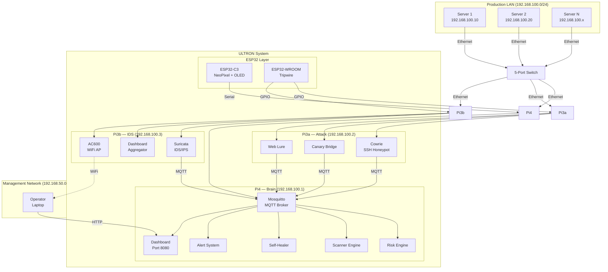

<div align="center">


# 🛡️ ULTRON

## Autonomous Cybersecurity on a $290 Raspberry Pi Stack

**Black Hat Asia 2027 Arsenal Submission** | MIT License | Zero Cloud Dependency

[](https://opensource.org/licenses/MIT)
[](https://www.blackhat.com/asia-27/arsenal.html)
[](https://www.raspberrypi.com/)
[](#-cost-comparison)
[](#-design-philosophy)

</div>

---

## The Problem

> **60% of small businesses close within 6 months of a cyberattack.**
> Schools, small companies, and home labs face the same threats as enterprises — but can't afford enterprise solutions.

| Solution | Annual Cost | Complexity |
|----------|------------|------------|
| SOC Team (in-house) | $500K–$2M | High |
| Managed Security (MSSP) | $60K–$240K/yr | Medium |
| Commercial Appliance (Fortinet) | $2K+ hardware + licensing | High |
| **ULTRON** | **$290 (one-time)** | **Plug & play** |

Existing open-source tools (Snort, Wazuh, OpenVAS) **detect but don't respond**. ULTRON is the first open-source system that **monitors → scores → auto-remediates** in a single $290 package.

---

## What Is ULTRON?

A **modular cybersecurity appliance** built on 3 Raspberry Pi nodes. Plug it into any server room Ethernet switch and it immediately begins:

```
┌─────────────────────────────────────────────────────────────┐
│                    30-SECOND PITCH                          │
│                                                             │
│  🔍 SCAN     nmap + Nuclei + Lynis — find every weakness   │
│  🪤 LURE     Cowrie honeypot + canary files — trap attackers│
│  🛡️ DETECT   Suricata IDS + GPIO tripwires — catch intrusions│
│  🧠 SCORE    6 signals → single 0-100 risk score           │
│  ⚡ RESPOND   Auto-heal: block IPs, restart services, quarantine│
│  📊 REPORT   Live dashboard + email alerts + daily .md logs │
│                                                             │
│  Total cost: $290  |  Zero cloud  |  1 person (or none)     │
└─────────────────────────────────────────────────────────────┘
```

---

## How It Works

### Detection → Scoring → Response Pipeline

```
┌─────────┐    ┌─────────┐    ┌─────────┐    ┌─────────┐    ┌─────────┐    ┌─────────┐
│ DETECT  │───▶│ COLLECT │───▶│  SCORE  │───▶│ DECIDE  │───▶│ RESPOND │───▶│ REPORT  │
└─────────┘    └─────────┘    └─────────┘    └─────────┘    └─────────┘    └─────────┘
     │              │              │              │              │              │
  Sensors       MQTT Events    Risk Score     Risk Band     Firewall      Dashboard
  detect        publish to     clamp(0..100,  threshold     rules,        + Email
  anomalies     broker         Σ × weights)   check         restart       + .md report
```

### The Risk Scoring Engine

Fuses **6 signal sources** into a single score:

| Signal | Source | Weight |
|--------|--------|--------|
| Canary events | Cowrie honeypot + file access | 25% |
| Rule alerts | Suricata IDS signatures | 20% |
| Scanner findings | nmap / Nuclei / Lynis | 15% |
| IDS alerts | Network intrusion detection | 15% |
| Tripwire | Physical enclosure sensors | 15% |
| Behavioral | Unusual traffic patterns | 10% |

**Formula:** `Risk Score = clamp(0..100, Σ component × weight)` — decays 2 pts every 10 seconds.

### Risk Bands → Automated Response

| Band | Range | What Happens |
|------|-------|-------------|
| 🟢 **GREEN** | 0–29 | Normal monitoring. Breathing LED. |
| 🟡 **YELLOW** | 30–59 | Increase scan frequency. Chasing LED. |
| 🔴 **RED** | 60–84 | Activate IPS mode. Block IPs. Email alert. Strobe LED. |
| 🟣 **PURPLE** | 85–100 | **Full quarantine.** All ports blocked. Tripwire buzzer. Pulsing LED. |

---

## Architecture

### System Overview

<div align="center">



</div>

### Dual-Network Design

| Network | Purpose | Subnet | Interface |
|---------|---------|--------|-----------|
| **Wired LAN** (Production) | Server monitoring, scanning, IDS | 192.168.100.0/24 | Pi eth0 → Switch → Servers |
| **WiFi Hotspot** (Management) | Operator dashboard access | 192.168.50.0/24 | Pi3b AC600 → Laptop |

Production and management are **physically separated** — compromising WiFi doesn't expose monitoring infrastructure.

### Node Roles

<table>
<tr>
<td width="33%">

### 🧠 Pi4 — The Brain
**Pi4 8GB | 192.168.100.1**

- MQTT Broker (Mosquitto)
- Risk Scoring Engine
- Scanner (nmap + Nuclei + Lynis)
- Self-Healing Framework
- Dashboard (Port 8080)
- Alert System (SMTP)

</td>
<td width="33%">

### ⚔️ Pi3a — Attack Node
**Pi3B+ 1GB | 192.168.100.2**

- Cowrie SSH Honeypot
- Canary Bridge (auditd)
- Web Lure (fake admin page)
- TL-WN722N (monitor mode)

</td>
<td width="33%">

### 🛡️ Pi3b — IDS Gateway
**Pi3B+ 1GB | 192.168.100.3**

- Suricata IDS/IPS
- Dashboard Aggregator
- AC600 WiFi Hotspot
- dnsmasq (DHCP + DNS)

</td>
</tr>
</table>

---

## What Makes ULTRON Different

<table>
<tr>
<td width="50%">

### 🔍 Not Just Detection — **Response**

Existing tools stop at alerts. ULTRON auto-heals:
- ❌ Unauthorized SSH? → Kill session + block IP
- ❌ Open port found? → Close via nftables
- ❌ Expired TLS cert? → Auto-renew with certbot
- Circuit breaker prevents remediation loops

</td>
<td width="50%">

### 🎓 Dual Mode: Production + Education

**ULTRON Mode:** Full autonomous protection. 24/7, zero human needed.

**LAB Mode:** Live CTF training platform. Students attack a real security stack, earn leaderboard points. Challenges include port scanning, vuln hunting, honeypot escape, and full compromise.

</td>
</tr>
<tr>
<td width="50%">

### 🔌 Physical + Digital Feedback

Not just software — ULTRON has a physical presence:
- NeoPixel ring shows threat color in real-time
- OLED displays current risk score
- Tripwire sensors detect enclosure tampering
- Buzzer sounds on PURPLE quarantine

</td>
<td width="50%">

### 🌐 Zero Cloud, Zero Agents

- No internet required after setup
- No agents installed on production servers
- All processing happens locally
- MQTT-only communication (no HTTP between nodes)
- SQLite for local persistence

</td>
</tr>
</table>

---

## Hardware — $290 Total

| # | Component | Cost | Purpose |
|---|-----------|------|---------|
| 1 | Raspberry Pi 4 (8GB) | $75 | Brain — orchestrator, scanner, dashboard |
| 2 | Raspberry Pi 3B+ (×2) | $60 | Attack node + IDS gateway |
| 3 | 500GB USB SSD | $35 | Logs, evidence vault |
| 4 | ESP32-C3 SuperMini | $4 | NeoPixel LED + OLED display |
| 5 | ESP32-WROOM-32 | $5 | Tripwire sensors + buzzer |
| 6 | WS2812B NeoPixel Ring | $3 | Visual threat indicator |
| 7 | SSD1306 OLED | $3 | Text status display |
| 8 | TL-WN722N + AC600 | $24 | Monitor mode + WiFi hotspot |
| 9 | 5-Port Switch + Hub + Wire | $26 | LAN backbone + GPIO wiring |
| 10 | Power + Cooling | $22 | 3 adapters + USB fan |
| | | **~$263** | |

**vs. Enterprise alternatives:** Fortinet ($2K+), Palo Alto ($5K+), CrowdStrike ($10K+/yr).

---

## Operating Modes

### ULTRON Mode (Default)
```
✅ Auto-scan every 15 min    ✅ Risk engine continuous
✅ Self-healing ON           ✅ Suricata: IDS → IPS (score > 60)
✅ Email alerts              ✅ ESP32: live threat color
✅ TL-WN722N: monitor only   ✅ Full autonomous 24/7
```

### LAB Mode (Education)
```
✅ Student-triggered scans   ✅ Risk scores (no auto-response)
✅ Honeypot + canaries active ✅ Leaderboard + challenges
✅ TL-WN722N: full attack     ✅ ESP32: shows risk, no quarantine
🎓 Challenges: Port Scan, Vuln Hunt, WiFi Recon, Honeypot Escape
```

---

## Dashboard

Single HTML file, no frameworks, no build tools. Real-time via WebSocket.

```
┌─────────────────────────────────────────────────┐
│                 ULTRON DASHBOARD                  │
├──────────┬──────────┬──────────┬─────────────────┤
│ RISK     │ BAND     │ NODE     │ MODE            │
│ SCORE    │ COLOR    │ STATUS   │ ULTRON / LAB    │
│ (gauge)  │ (green/  │ (3 nodes │                 │
│          │ yellow/  │ up/down) │                 │
│          │ red/     │          │                 │
│          │ purple)  │          │                 │
├──────────┴──────────┴──────────┴─────────────────┤
│              ACTIVE ALERTS                        │
├──────────────────────────────────────────────────┤
│         RECENT SCANS + SELF-HEALING LOG           │
├──────────────────────────────────────────────────┤
│         RISK HISTORY (24h chart)                  │
└──────────────────────────────────────────────────┘
```

---

## Quick Start

```bash
# 1. Flash Raspberry Pi OS Lite to 3 microSD cards
# 2. Configure static IPs:
#    Pi4: 192.168.100.1 | Pi3a: .2 | Pi3b: .3

# 3. On all nodes:
sudo apt update && sudo apt upgrade -y
sudo apt install -y python3 python3-pip mosquitto mosquitto-clients

# 4. On Pi4 (Brain):
sudo apt install -y sqlite3 nmap nuclei lynis

# 5. On Pi3a (Attack):
sudo apt install -y cowrie auditd

# 6. On Pi3b (IDS):
sudo apt install -y suricata hostapd dnsmasq

# 7. Clone + deploy:
git clone https://github.com/ADITYA02NM/ULTRON.git
cd ULTRON && pip3 install -r requirements.txt
sudo cp systemd/*.service /etc/systemd/system/
sudo systemctl daemon-reload
sudo systemctl enable --now sentinel-*

# 8. Connect Pi3b's AC600 WiFi → browse to http://192.168.100.1:8080
```

---

## Roadmap

| Phase | Milestone | Status |
|-------|-----------|--------|
| **v1.0** | Core architecture + risk scoring | ✅ Designed |
| **v1.1** | Self-healing engine + circuit breaker | ✅ Designed |
| **v1.2** | Dashboard + WebSocket real-time | ✅ Designed |
| **v2.0** | LAB mode + leaderboard + CTF challenges | 📋 Planned |
| **v3.0** | ULTRON-X: Jetson Nano variant (ML anomaly detection) | 📋 Planned |
| **Black Hat** | Asia 2027 Arsenal demo | 🎯 Target |

---

## Contributing

1. Fork → Branch → Commit → Push → PR
2. Follow PEP 8 for Python
3. Add tests for new features
4. Use conventional commits

---

## License

MIT License — use it, modify it, deploy it.

---

<div align="center">

**Built for the organizations that can't afford to be unprotected.**

[](https://www.blackhat.com/asia-27/arsenal.html)

</div>
