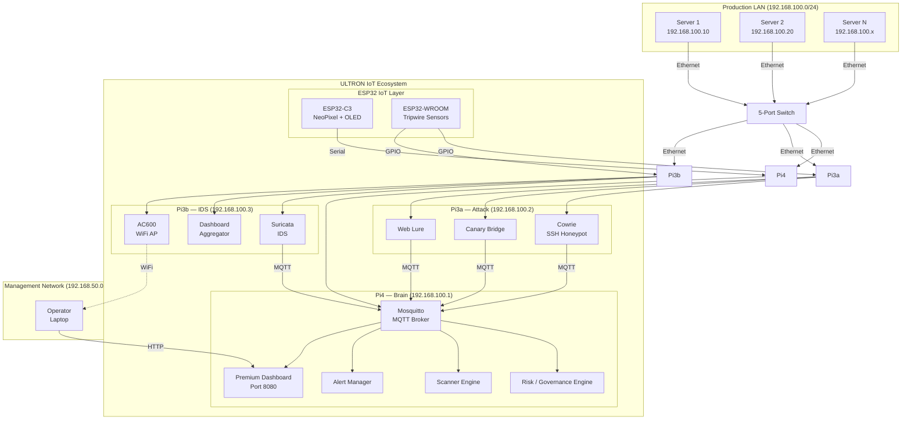

<div align="center">


# 🛡️ ULTRON

## Autonomous IoT Cybersecurity Ecosystem

**Black Hat Asia 2027 Arsenal — IoT Track** | MIT License | Zero Cloud Dependency

[](https://opensource.org/licenses/MIT)
[](https://www.blackhat.com/asia-27/arsenal.html)
[](#-black-hat-asia-2027--iot-track)
[](#-hardware--290-total)
[](#-design-philosophy)

</div>

---

## The Problem

> **IoT devices are the weakest link — and nobody's watching them.**

Smart devices, sensors, and edge hardware are exploding across every network. Traditional security tools don't see the sensor layer:

- Physical tripwire tampering goes **undetected**
- Compromised microcontrollers are **invisible** to enterprise IDS
- Small organizations can't afford SOC teams ($500K+/yr)
- Existing IoT security is either **too expensive** or **too passive**

60% of small businesses close within 6 months of a cyberattack. The gap isn't more alerts — it's an **autonomous ecosystem** that detects, governs, and manages risk at the IoT layer.

---

## What Is ULTRON?

An **autonomous IoT cybersecurity ecosystem** built on 3 Raspberry Pi nodes + 2 ESP32 microcontrollers. Plug it into any server room via Ethernet and it immediately begins:

```
┌────────────────────────────────────────────────────────────────┐
│                    ULTRON — 30 SECOND OVERVIEW                 │
│                                                                │
│  🔍 DETECT     Suricata IDS + Cowrie honeypot + canary files  │
│                + ESP32 physical tripwire sensors               │
│                                                                │
│  📊 GOVERN     Risk scoring engine fuses 6 signals into        │
│                a single 0-100 score → 4 bands drive response   │
│                                                                │
│  🔔 ALERT      Premium real-time dashboard (WebSocket)         │
│                + email alerts + LED/OLED physical indicators    │
│                                                                │
│  💰 $290 total  |  🌐 Zero cloud  |  👤 1 operator (or none)   │
└────────────────────────────────────────────────────────────────┘
```

---

## Black Hat Asia 2027 — IoT Track

**Phase 1 (Demo Scope):**

| Pillar | What We Show |
|--------|-------------|
| **Detection** | Multi-layer IoT + network detection: Suricata IDS, Cowrie honeypot, canary files, ESP32 tripwire sensors, wireless monitoring |
| **Governance** | Risk scoring engine: 6 weighted signals → 0-100 score → GREEN/YELLOW/RED/PURPLE bands with automated escalation policy |
| **Alert Management** | Premium dashboard (real-time WebSocket), email alerts, NeoPixel + OLED physical indicators, daily Markdown reports |

**Future Scope (Post-Demo):**

| Phase | Capability |
|-------|-----------|
| **Phase 2** | Automated response — firewall rules, service restarts, IP quarantine |
| **Phase 3** | Automated threat analysis & hunting — behavioral baselines, anomaly correlation, attack-path inference |

---

## How It Works — Detection → Governance → Alert

```
┌─────────┐    ┌─────────┐    ┌─────────┐    ┌─────────┐    ┌─────────┐
│ DETECT  │───▶│ COLLECT │───▶│  SCORE  │───▶│ DECIDE  │───▶│  ALERT  │
└─────────┘    └─────────┘    └─────────┘    └─────────┘    └─────────┘
     │              │              │              │              │
  IoT + network  MQTT Events    Risk Score     Risk Band     Dashboard
  sensors        publish to     clamp(0..100,  threshold     + Email
  detect         broker         Σ × weights)   check         + LED/OLED
  anomalies                                               + .md report
```

### The Risk Governance Engine

Fuses **6 signal sources** into a single governed score:

| Signal | Source | Weight |
|--------|--------|--------|
| Canary events | Cowrie honeypot + file access | 25% |
| Rule alerts | Suricata IDS signatures | 20% |
| Scanner findings | nmap / Nuclei / Lynis | 15% |
| IDS alerts | Network intrusion detection | 15% |
| Tripwire | ESP32 physical sensors (IoT layer) | 15% |
| Behavioral | Unusual traffic patterns | 10% |

**Formula:** `Risk Score = clamp(0..100, Σ component × weight)` — decays 2 pts every 10 seconds toward baseline.

### Risk Bands → Escalation Policy

| Band | Range | LED | Alert Action |
|------|-------|-----|-------------|
| 🟢 **GREEN** | 0–29 | Breathing | Normal monitoring. No action. |
| 🟡 **YELLOW** | 30–59 | Chasing | Increase scan frequency. Detailed logging. Dashboard highlight. |
| 🔴 **RED** | 60–84 | Strobe | Critical email alert. Dashboard alarm state. (IPS activation: Phase 2) |
| 🟣 **PURPLE** | 85–100 | Pulsing | Highest escalation. Tripwire buzzer. Full incident report. (Quarantine: Phase 2) |

---

## Architecture

### System Overview

<div align="center">



</div>

### Dual-Network Design

| Network | Purpose | Subnet | Interface |
|---------|---------|--------|-----------|
| **Wired LAN** (Production) | Server monitoring, scanning, IDS | 192.168.100.0/24 | Pi eth0 → Switch → Servers |
| **WiFi Hotspot** (Management) | Operator dashboard access | 192.168.50.0/24 | Pi3b AC600 → Laptop |

Production and management are **physically separated** — compromising WiFi never exposes the monitoring infrastructure.

### Node Roles

<table>
<tr>
<td width="33%">

### 🧠 Pi4 — The Brain
**Pi4 8GB | 192.168.100.1**

- MQTT Broker (Mosquitto)
- Risk / Governance Engine
- Scanner (nmap + Nuclei + Lynis)
- Alert Manager (SMTP + WebSocket)
- **Premium Dashboard (Port 8080)**

</td>
<td width="33%">

### ⚔️ Pi3a — Attack Node
**Pi3B+ 1GB | 192.168.100.2**

- Cowrie SSH Honeypot
- Canary Bridge (auditd)
- Web Lure (fake admin page)
- TL-WN722N (monitor mode)

</td>
<td width="33%">

### 🛡️ Pi3b — IDS Gateway
**Pi3B+ 1GB | 192.168.100.3**

- Suricata IDS
- Dashboard Aggregator
- AC600 WiFi Hotspot
- dnsmasq (DHCP + DNS)

</td>
</tr>
</table>

### ESP32 IoT Sensor Layer

<table>
<tr>
<td width="50%">

### 💡 ESP32-C3 — Indicator Node
- WS2812B NeoPixel ring (8 LEDs) — live risk-band color
- SSD1306 OLED — risk score + node status text
- USB serial link to Pi4

</td>
<td width="50%">

### 🔒 ESP32-WROOM — Tripwire Node
- GPIO16 → Pi3a enclosure sensor
- GPIO17 → Pi3b enclosure sensor
- Passive buzzer alarm (GPIO4)
- Enclosure tamper detection (pull-up, trigger LOW)

</td>
</tr>
</table>

---

## 📊 Premium Dashboard

> **No compromise.** The dashboard is the centerpiece of the alert-management pillar.

**Single HTML file** — pure HTML + CSS + vanilla JavaScript. No frameworks, no build tools, no CDN dependencies. Served from Pi4 on port 8080 with real-time WebSocket push from MQTT.

### Design Standard

| Requirement | Standard |
|-------------|----------|
| **Latency** | Event → screen in <100ms (WebSocket push, no polling) |
| **Visual language** | Risk-band color themes entire UI (GREEN/YELLOW/RED/PURPLE) |
| **Typography** | Monospace technical aesthetic, consistent spacing scale |
| **Components** | Animated risk gauge, sparkline history, alert cards, node health grid |
| **Dark theme** | Default dark UI — operator-grade, no glare |
| **Responsiveness** | Works on laptop + tablet (operator anywhere on management WiFi) |
| **Zero dependencies** | No React, no CDN, no npm — one file you can open offline |

### Panel Layout

```
┌─────────────────────────────────────────────────────────────┐
│  ULTRON // IoT SECURITY ECOSYSTEM              [ULTRON MODE]│
├────────────┬────────────┬────────────┬──────────────────────┤
│  RISK      │  BAND      │  NODES     │  DETECTION LAYERS    │
│  ┌──────┐  │  🟢 GREEN  │  Pi4  ✅   │  IDS        ✅       │
│  │ 42   │  │            │  Pi3a ✅   │  Honeypot   ✅       │
│  │/100  │  │  score: 42 │  Pi3b ✅   │  Scanners   ✅       │
│  └──────┘  │            │  ESP32 ✅  │  Tripwire   ✅       │
├────────────┴────────────┴────────────┴──────────────────────┤
│  ACTIVE ALERTS                              [ACK] [EXPORT]   │
│  🔴 CRITICAL  Suricata: ET SCAN masscan detected  2m ago    │
│  🟡 WARNING   Cowrie: SSH brute-force 10.0.0.55    5m ago   │
│  🟢 INFO      Canary: /etc/passwd accessed         8m ago   │
├─────────────────────────────────────────────────────────────┤
│  RISK HISTORY (24h)     │  RECENT SCANS     │  ALERT LOG    │
│  ~~~~/\__/~~~ line      │  nmap: 12 hosts   │  47 events    │
│  chart color-coded      │  nuclei: 0 CVEs   │  last 24h     │
├─────────────────────────────────────────────────────────────┤
│  GOVERNANCE: score decay 2pts/10s │ reports: daily .md      │
└─────────────────────────────────────────────────────────────┘
```

### Alert Management Features

- **Real-time push** — MQTT → WebSocket → DOM update, no refresh
- **Severity tiers** — CRITICAL / WARNING / INFO with distinct visuals
- **Acknowledgement** — operators can ack alerts (state synced to SQLite)
- **Export** — one-click Markdown report download
- **Email** — RED/PURPLE bands trigger SMTP notification
- **Physical echo** — LED color + OLED text mirror dashboard state

---

## Hardware — $290 Total

| # | Component | Cost | Role |
|---|-----------|------|------|
| 1 | Raspberry Pi 4 (8GB) | $75 | Brain — orchestrator, risk engine, dashboard |
| 2 | Raspberry Pi 3B+ (×2) | $60 | Attack node + IDS gateway |
| 3 | 500GB USB SSD | $35 | Logs, evidence vault |
| 4 | ESP32-C3 SuperMini | $4 | NeoPixel + OLED indicator node |
| 5 | ESP32-WROOM-32 | $5 | Tripwire sensor node |
| 6 | WS2812B NeoPixel Ring | $3 | Visual threat indicator |
| 7 | SSD1306 OLED | $3 | Text status display |
| 8 | TL-WN722N + AC600 | $24 | Monitor mode + WiFi hotspot |
| 9 | 5-Port Switch + Hub + Wire | $26 | LAN backbone + GPIO wiring |
| 10 | Power + Cooling | $22 | 3 adapters + USB fan |
| | **Total** | **~$263** | + case ≈ $290 |

### Power Budget

| Component | Power |
|-----------|-------|
| Pi4 8GB | 15W |
| Pi3a + Pi3b | 10W |
| SSD + WiFi + ESP32s + fan | ~10W |
| **Total** | **~38W** |

---

## Design Philosophy

- **Zero cloud dependency** — all processing local, MQTT internal only
- **Fail-closed defaults** — deny-all firewall, authenticated broker, key-only SSH
- **Modular IoT ecosystem** — add sensors/nodes without redesign
- **Observable posture** — every event scored, displayed, physically echoed
- **Minimal admin** — automated detection + governance; 1 operator (or none)
- **Phased autonomy** — Phase 1 detects/governs/alerts; Phase 2 responds; Phase 3 hunts

---

## Operating Modes

### ULTRON Mode (Default — Production)
- Auto-scan every 15 min, continuous risk scoring
- Alert manager active (dashboard + email)
- Suricata IDS monitoring, LED live risk-band color
- Fully autonomous 24/7

### LAB Mode (Education / CTF)
- Student-triggered scans only, scoring without auto-escalation
- Honeypot + canaries live as CTF targets
- Leaderboard + challenges (Port Scan, Vuln Hunt, WiFi Recon, Honeypot Escape)
- TL-WN722N full attack capability

---

## Quick Start

```bash
# 1. Flash Raspberry Pi OS Lite to 3 microSD cards
# 2. Static IPs: Pi4=192.168.100.1 | Pi3a=.2 | Pi3b=.3

# 3. All nodes:
sudo apt update && sudo apt upgrade -y
sudo apt install -y python3 python3-pip mosquitto mosquitto-clients

# 4. Pi4 (Brain):
sudo apt install -y sqlite3 nmap nuclei lynis

# 5. Pi3a (Attack):
sudo apt install -y cowrie auditd

# 6. Pi3b (IDS):
sudo apt install -y suricata hostapd dnsmasq

# 7. Deploy:
git clone https://github.com/ADITYA02NM/ULTRON.git
cd ULTRON && pip3 install -r requirements.txt
sudo cp systemd/*.service /etc/systemd/system/
sudo systemctl daemon-reload && sudo systemctl enable --now sentinel-*

# 8. Connect to SENTINEL-SECURE WiFi → http://192.168.100.1:8080
```

See [`promt.md`](promt.md) for the full hardware-role assignment prompt (premium AI operating brief).

---

## Roadmap

| Phase | Capability | Status |
|-------|-----------|--------|
| **Phase 1 — Black Hat Demo** | Detection + Governance + Alert Management | 🎯 Current |
| **Phase 2** | Automated response (firewall, restarts, quarantine) | 📋 Future |
| **Phase 3** | Automated threat analysis & hunting (behavioral baselines, anomaly correlation, attack-path inference) | 📋 Future |
| **ULTRON-X** | Jetson Nano variant — ML-powered anomaly detection | 📋 Future |
| **Black Hat** | Asia 2027 Arsenal — IoT track demo | 🎯 Target |

---

## Repository Structure

```
ULTRON/
├── README.md          # This file — IoT ecosystem pitch
├── architecture.md    # In-depth architecture (networks, nodes, pipeline, MQTT)
├── dashboard.md       # Premium dashboard full specification + acceptance gates
├── promt.md           # Premium AI prompt — hardware-role assignments
├── blackhat.md        # Full research paper / technical spec (Black Hat IoT track)
├── hardware.png       # Hardware architecture diagram
├── assets/
│   └── ultron-banner.svg
└── ULTRON(SEN3)/      # Local backup (gitignored)
```

---

## Contributing

1. Fork → Branch → Commit → Push → PR
2. Follow PEP 8 for Python
3. Add tests for new features
4. Use conventional commits

---

## License

MIT License — use it, modify it, deploy it.

---

<div align="center">

**An autonomous IoT ecosystem that detects, governs, and alerts — for $290.**

[](https://www.blackhat.com/asia-27/arsenal.html)

</div>
